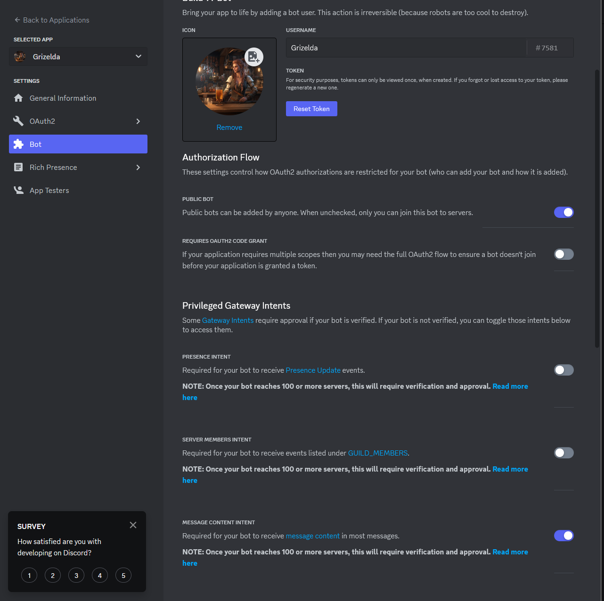
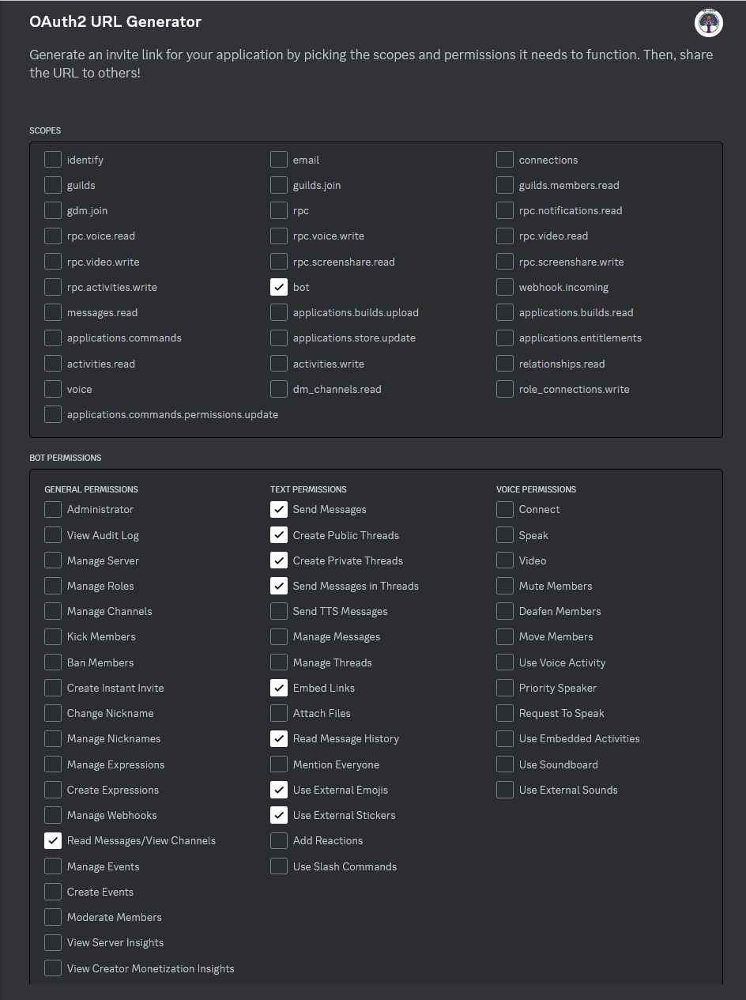
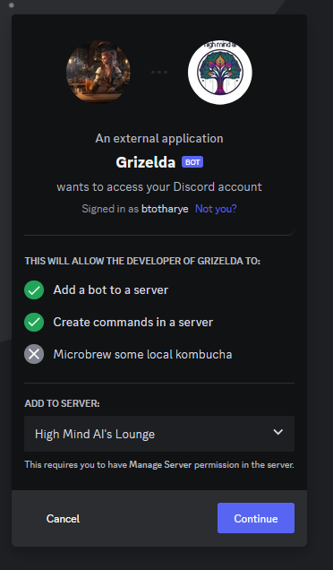

**************
Initial Setup
**************
One of the first things you have to do is get a Discord bot setup, so that you have the required bot token that you will need to supply to the code to interact in Discord.  The next sections go over this process.

Discord Bot Setup
------------------
So the first thing you will need to do is follow the instructions found `Here <https://discord.com/developers/docs/getting-started#step-1-creating-an-app>`_ and create an App.  

You will want to follow the docs and basically setup a bot app, update the avatar/pic and put some information in the description and hit save. 

Now you can follow like the doc shows and go to the bot section and setup the required scope/permissions.  The permissions that should be required are outlined below:

Under the Bot section there is a Privileged Gateway Intents section, you will want to enable the Message Content Intent.

In this same section you will also see the Reset Token button, click this and save that securely somewhere, preferably in Doppler as discussed in the next section.

As you can see from the image you should now be able to click `Reset Token` and this will become your `DISCORD_BOT_TOKEN` secret.

Discord OAuth Setup
-------------------
Click on the Oauth2 section under the Settings on the left side, and we need to select the following scopes to generate the URL:

Make sure you select bot under scope then these below are all the Bot Permissions you need to select.

Text Permissions:

.. parsed-literal::

    Send Messages
    Create Public Threads
    Create Private Threads
    Send Messages in Threads
    Embed Links
    Read Message History
    Use External Emojis
    Use External Stickers

General Permissions:

.. parsed-literal::

    Read Messages/View Channels

At the bottom of this image there is a URL, copy this and open it in a browser to add your new Bot to your server.  You should see something like the image below:

At this point you should now have your bot account inside of your Discord server showing up and online.

Discord Bot Role
-----------------
So after all of this has been done, you should also have a role on your Discord server called the same name you named your bot application.  You can use this to control what channels your bot responds in, atm the code will respond to any text in a channel.

My recommendation is to take this role and lock it down to one specific channel to work out of.