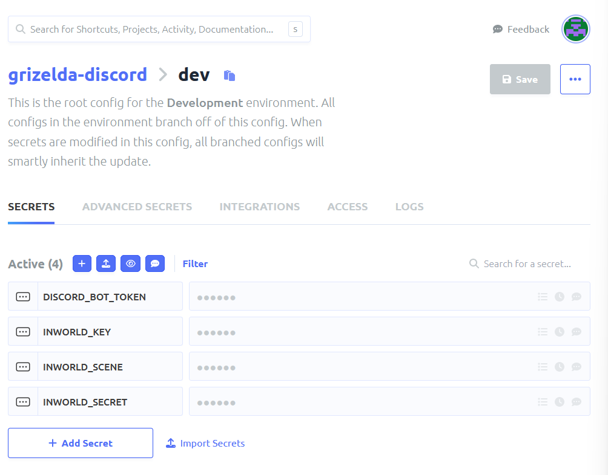

********************
Secrets Management
********************
So now we have our Discord bot setup, we need somewhere to store our secrets securely.  For this project we are going to have 4 secrets total:

.. parsed-literal::

    DISCORD_BOT_TOKEN
    INWORLD_KEY
    INWORLD_SCENE
    INWORLD_SECRET

I recommend using `Doppler <https://doppler.com/join?invite=214F6535>`_ it allows you for free to store your secrets securely and use them locally and through your development lifecycle/deployment.

So we will go to Doppler and setup a new project and create secrets accordingly for each of the above values.  The Inworld secrets can be found in your Inworld Studio upon logging under the `Integrations` section.

You should have something that looks like the following, if you don't want to use this method you can use env vars or such that will work the same way but ensure you don't put these in version control, etc.

